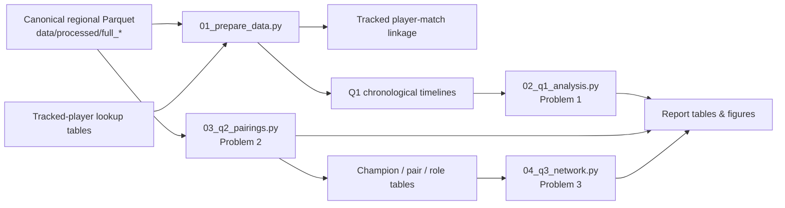

# Finding the Needle in Ranked Play

### Behavioral and Strategic Patterns in League of Legends

Data Science final project for **67978 — A Needle in a Data Haystack: Introduction to Data Science**.

This project studies League of Legends ranked play from three complementary perspectives: **player behavior over time**, **champion-pair relationships**, and **the larger champion co-selection network**. The submitted pipeline starts from the cleaned Parquet data in `data/processed/` and is designed to run on **Linux, Windows, or macOS**.

> **Fastest way to reproduce everything**
>
> ```bash
> python -m pip install -r requirements.txt
> python code/run_project.py
> ```
>
> Running `run_project.py` with no subcommand executes data preparation and all three analysis problems.

---

## Project at a glance

| Item | Scale / choice |
| --- | ---: |
| Unique physical matches | **497,102** |
| Participant rows | **4,971,020** |
| Team rows | **994,204** |
| Regions | **NA, KR, EU** |
| Main longitudinal cohort | **11,169 authoritative player-region identities** |
| Main target queue | **420 — Ranked Solo/Duo** |
| Processed format | **Parquet** |
| Normal reproduction starting point | `data/processed/` |
| Python | **3.10+** |

The original source corpus is Riot Match-V5-style ranked-match data. Exact source/provenance notes are kept in `data/data_sources.txt`; the normal submitted workflow does **not** require the original tens-of-gigabytes raw JSON corpus.

---

## Research problems

### 1. Temporal Behavior & Next-Match Performance

**Question:** How are recent competitive volume, session depth, and post-loss requeue timing associated with performance in a player's subsequent Ranked Solo/Duo match?

Main methods:
- target-centric chronological feature engineering;
- within-player linear probability models;
- player fixed effects and two-way clustered uncertainty;
- Holm multiple-testing correction;
- chronological train/validation/test evaluation;
- entropy-based decision trees and standard classification metrics;
- cohort, duration, session-boundary, and activity-window robustness checks.

**Main result:** the estimated behavioral effects are generally small, non-monotonic, and inconsistent across regions. Behavior adds only a small held-out ROC-AUC improvement beyond historical performance features.

### 2. Champion Pairings & Combo Performance

**Question:** Which champion pairs are selected together more often than expected, and how is co-selection strength related to pair performance?

Main methods:
- raw same-team co-pick frequency;
- popularity-normalized co-selection using **log2(lift)**;
- descriptive pair win rate and win surplus;
- joint association-performance visualization with support filtering.

**Main result:** raw popularity and normalized association identify different pairings, and strong co-selection does not automatically imply stronger pair performance.

### 3. Champion Network Structure & Team-Composition Communities

**Question:** What larger structural patterns emerge from the champion co-selection network, and which champions and communities occupy central roles within team compositions?

Main methods:
- weighted champion graphs;
- **Louvain** communities and modularity;
- association-weighted **PageRank**;
- maximal cliques and clique percolation;
- Girvan-Newman comparison;
- K-Means++, hierarchical clustering, DBSCAN, PCA, and cosine profile similarity.

**Main result:** the normalized co-selection network contains interpretable role-related communities, central champions, and recurring higher-order composition structures. Conventional clustering captures a coarser version of the same relational structure.

---

## Pipeline overview



The three scientific problems are intentionally separated in code. Problem 1 is longitudinal and requires tracked-player timelines; Problem 2 is team-composition analysis over all valid teams; Problem 3 consumes the compact pair tables produced by Problem 2.

---

## Repository layout

```text
project/
├── code/
│   ├── 01_prepare_data.py       # validate processed data; rebuild linkage/audits/Q1 timelines
│   ├── 02_q1_analysis.py        # Problem 1: EDA, inference, prediction, robustness, figures
│   ├── 03_q2_pairings.py        # Problem 2: pair frequency, lift, performance, figures
│   ├── 04_q3_network.py         # Problem 3: communities, PageRank, cliques, clustering
│   └── run_project.py           # single cross-platform entry point
├── data/
│   ├── processed/               # required processed inputs + generated linkage/audits
│   ├── analysis/                # generated scientific outputs
│   └── data_sources.txt         # source/provenance notes
├── docs/
│   ├── DATA_AND_PIPELINE_GUIDE.md
│   ├── REPRODUCIBILITY.md
│   └── ANALYSIS_REFERENCE.md
├── report/
│   ├── Report.docx
│   ├── Report.pdf
│   ├── Report_noimages.docx
│   └── Report_noimages.pdf
├── requirements.txt
├── .gitignore
└── README.md
```

Large raw/canonical Parquet files are not suitable for normal Git hosting. A clone of the code repository therefore still needs the required processed data copied into the expected `data/processed/` layout before execution.

---

## Required processed inputs

The normal pipeline **starts from processed data**. Keep:

```text
data/processed/full_na/
data/processed/full_kr/
data/processed/full_eu/

data/processed/tracking/authoritative/NA/tracked_players.parquet
data/processed/tracking/authoritative/KR/tracked_players.parquet
data/processed/tracking/authoritative/EU/tracked_players.parquet

data/processed/tracking/alias_confirmed/NA/tracked_players.parquet
data/processed/tracking/alias_confirmed/KR/tracked_players.parquet
data/processed/tracking/alias_confirmed/EU/tracked_players.parquet
```

The small tracked-player lookup tables are processed provenance inputs. They were reconstructed earlier from stable Riot PUUID evidence, seed lists, and `league_data.db`; that identity evidence cannot be recreated from the anonymized canonical Parquet alone.

The following are generated and can be deleted/rebuilt safely:

```text
data/analysis/
data/processed/analysis_audit/
data/processed/tracking/linked/
data/processed/tracking/coverage_audit/
```

---

## Quick start

### 1. Install

```bash
python -m pip install -r requirements.txt
```

### 2. Check the environment and inputs

```bash
python code/run_project.py check
```

### 3. Run the full project

```bash
python code/run_project.py
```

For a clean, validated rerun:

```bash
python code/run_project.py clean --yes
python code/run_project.py all --strict-reference
```

`--strict-reference` regression-checks the frozen Problem 1 results after Q1 completes.

### Individual stages

| Command | Purpose |
| --- | --- |
| `python code/run_project.py prepare` | Validate processed inputs and rebuild Q1 linkage/timelines |
| `python code/run_project.py q1` | Preparation + Problem 1 |
| `python code/run_project.py q1 --analysis-only` | Reuse existing Q1 timelines |
| `python code/run_project.py q2` | Problem 2 champion-pair analysis |
| `python code/run_project.py q3` | Problem 3 network analysis; requires Q2 tables |
| `python code/run_project.py all` | Preparation + Q1 + Q2 + Q3 |
| `python code/run_project.py clean --yes` | Remove only reproducible generated outputs |

More options, lab-machine notes, and troubleshooting are documented in [`docs/REPRODUCIBILITY.md`](docs/REPRODUCIBILITY.md).

---

## Main generated outputs

### Problem 1

```text
data/analysis/q1/
├── tables/
├── figures/
│   ├── report/
│   └── supplementary/
├── predictions/
└── audit/
```

Report figures:
1. inter-match-gap ECDF;
2. adjusted H1/H2/H3 effects with 95% CIs;
3. held-out ROC + normalized confusion matrix;
4. combined-tree feature importance;
5. top three levels of the entropy tree.

### Problem 2

```text
data/analysis/q2/
├── tables/
├── figures/
│   ├── report/
│   └── supplementary/
└── summary.json
```

Report figures:
6. raw co-pick frequency vs normalized association;
7. champion combo landscape.

### Problem 3

```text
data/analysis/q3/
├── tables/
├── figures/
│   ├── report/
│   └── supplementary/
└── summary.json
```

Report figures:
8. Louvain community network;
9. role composition of Louvain communities;
10. association-weighted PageRank;
11. strongest maximal cliques.

See [`docs/ANALYSIS_REFERENCE.md`](docs/ANALYSIS_REFERENCE.md) for the exact method-to-output mapping.

---

## Methodological guardrails

- **No target leakage in Q1.** Historical predictors are constructed strictly before the target match.
- **Queue 420 is the main target.** Observed ranked history may include queues 420 and 440.
- **Tracked-player membership is provenance-based.** It is never inferred from match count or history length.
- **Q2/Q3 use all valid teams**, not only tracked players, because the unit of analysis is champion/team composition.
- **Co-selection is not causal synergy.** Lift measures above/below-expected co-selection; win surplus is descriptive.
- **Graph communities are structural summaries**, not proof of strategic intent.
- **Large sample sizes require practical interpretation.** Effect sizes, confidence intervals, robustness, and predictive value matter more than isolated p-values.
- **The project is observational.** Results should not be interpreted as causal evidence of fatigue, tilt, or champion synergy.

---

## Documentation

- [`DATA_AND_PIPELINE_GUIDE.md`](docs/DATA_AND_PIPELINE_GUIDE.md) — data layers, provenance, feature construction, formulas, and output contracts.
- [`REPRODUCIBILITY.md`](docs/REPRODUCIBILITY.md) — exact commands, clean reruns, reference checks, lab/Linux notes, and troubleshooting.
- [`ANALYSIS_REFERENCE.md`](docs/ANALYSIS_REFERENCE.md) — concise scientific reference for all three problems and their report figures.

---

## Final report

The repository contains both versions required for submission:

- [`report/Report.pdf`](report/Report.pdf) — illustrated report;
- [`report/Report_noimages.pdf`](report/Report_noimages.pdf) — compact text-only version.

The DOCX versions are retained for editable source provenance.
