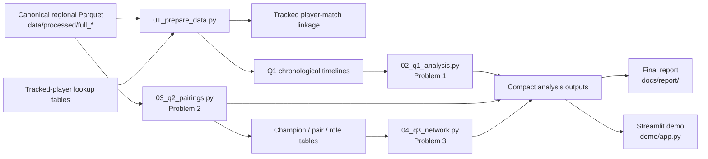

# Finding the Needle in Ranked Play

### Behavioral and Strategic Patterns in League of Legends

Final project for **67978 — A Needle in a Data Haystack: Introduction to Data Science**.

This project studies ranked League of Legends from three complementary perspectives:

1. **player behavior over time** — session depth, recent ranked volume, and post-loss requeue timing;
2. **champion pairings** — raw co-pick frequency, popularity-normalized association, and pair performance;
3. **champion network structure** — communities, central champions, cliques, and composition structure.

The project includes a reproducible Python pipeline, report-ready analyses/figures, and a lightweight **Streamlit results explorer**.

> **Full local reproduction**
>
> ```bash
> python -m pip install -r requirements.txt
> python code/run_project.py
> ```
>
> **Launch the interactive demo**
>
> ```bash
> streamlit run demo/app.py
> ```

---

## Project at a glance

| Item | Scale / choice |
| --- | ---: |
| Unique physical matches | **497,102** |
| Participant rows | **4,971,020** |
| Team rows | **994,204** |
| Regions | **NA, KR, EU** |
| Main longitudinal cohort | **11,169 authoritative player-region identities** |
| Main target queue | **420 — Ranked Solo/Duo** |
| Canonical processed format | **Parquet** |
| Normal full-pipeline starting point | `data/processed/` |
| Python | **3.10+** |

The original source corpus is Riot Match-V5-style ranked-match data. Source/provenance notes are kept in [`data/data_sources.txt`](data/data_sources.txt). The submitted workflow intentionally starts from the cleaned processed stage rather than requiring the original tens-of-gigabytes raw JSON corpus.

---

## Research problems

### 1 · Temporal Behavior & Next-Match Performance

**Question:** How are recent competitive volume, session depth, and post-loss requeue timing associated with performance in a player's subsequent Ranked Solo/Duo match?

**Methods**
- target-centric chronological feature engineering;
- player fixed effects via within-player demeaning;
- two-way clustered uncertainty by player and physical match;
- Holm multiple-testing correction;
- chronological train/validation/test evaluation;
- entropy decision trees;
- cohort, duration, session-boundary, and activity-window robustness checks.

**Main result:** the estimated behavioral effects are small, non-monotonic, and inconsistent across regions. Behavioral variables add only a small held-out ROC-AUC improvement beyond historical performance features.

### 2 · Champion Pairings & Combo Performance

**Question:** Which champion pairs are selected together more often than expected, and how is co-selection strength related to pair performance?

**Methods**
- raw same-team pair frequency;
- popularity-normalized co-selection using **log2(lift)**;
- pair win rate;
- descriptive win surplus;
- support-aware ranking and association/performance visualization.

**Main result:** raw popularity and normalized co-selection identify different champion pairs, and high co-selection strength does not automatically imply stronger pair performance.

### 3 · Champion Network Structure & Team-Composition Communities

**Question:** What larger structural patterns emerge from the champion co-selection network, and which champions and communities occupy central roles within team compositions?

**Methods**
- weighted champion graphs;
- **Louvain** communities and modularity;
- association-weighted **PageRank**;
- maximal cliques and clique percolation;
- Girvan-Newman comparison;
- K-Means++, hierarchical clustering, DBSCAN, PCA, and profile similarity.

**Main result:** the normalized co-selection network contains interpretable role-related communities, structurally central champions, and recurring higher-order composition patterns. Graph methods preserve relational structure more naturally than conventional profile clustering.

---

## Pipeline overview



The three scientific problems are intentionally separated in code. Problem 1 is longitudinal and requires tracked-player timelines; Problem 2 operates on valid five-champion teams; Problem 3 consumes the compact pair tables created by Problem 2.

---

## Repository layout

The local project contains both required inputs and reproducible generated outputs. Large/intermediate products are intentionally ignored by Git where appropriate.

```text
project/
├── .streamlit/
│   └── config.toml
├── code/
│   ├── 01_prepare_data.py
│   ├── 02_q1_analysis.py
│   ├── 03_q2_pairings.py
│   ├── 04_q3_network.py
│   └── run_project.py
├── data/
│   ├── analysis/
│   │   ├── q1/
│   │   ├── q2/
│   │   ├── q3/
│   │   └── timelines/              # generated; normally ignored by Git
│   ├── processed/
│   │   ├── full_na/
│   │   ├── full_kr/
│   │   ├── full_eu/
│   │   ├── analysis_audit/         # generated
│   │   └── tracking/
│   │       ├── authoritative/
│   │       ├── alias_confirmed/
│   │       ├── audit/
│   │       ├── coverage_audit/     # generated
│   │       └── linked/             # generated
│   ├── raw/
│   │   └── .gitkeep
│   └── data_sources.txt
├── demo/
│   ├── app.py
│   └── README.md
├── docs/
│   ├── ANALYSIS_REFERENCE.md
│   ├── DATA_AND_PIPELINE_GUIDE.md
│   ├── REPRODUCIBILITY.md
│   └── report/
│       ├── Report.pdf
│       ├── Report.docx
│       ├── Report_noimages.pdf
│       ├── Report_noimages.docx
│       └── graphics/
├── README.md
└── requirements.txt
```

A local `generate_project_tree.py` helper may also be present. It is only a development convenience and is not required by the scientific pipeline or the demo.

---

## Final report

The report now lives under `docs/report/`.

- **[Illustrated report (PDF)](docs/report/Report.pdf)**
- **[Illustrated report (DOCX)](docs/report/Report.docx)**
- **[Text-only report (PDF)](docs/report/Report_noimages.pdf)**
- **[Text-only report (DOCX)](docs/report/Report_noimages.docx)**

The `docs/report/graphics/` folder contains the visual source assets used to assemble the illustrated report.

---

## Two ways to use the repository

### A. View the results / run the demo

The compact Q1/Q2/Q3 result tables and report figures are suitable for GitHub and are used directly by the Streamlit app:

```text
data/analysis/q1/tables/
data/analysis/q1/figures/report/

data/analysis/q2/tables/
data/analysis/q2/figures/report/

data/analysis/q3/tables/
data/analysis/q3/figures/report/
```

If those files are present, the demo can run **without** the huge canonical Parquet corpus:

```bash
streamlit run demo/app.py
```

This is also the intended deployment model for Streamlit Community Cloud.

### B. Reproduce the full analysis

Full reproduction starts from the canonical processed inputs:

```text
data/processed/full_na/
data/processed/full_kr/
data/processed/full_eu/

data/processed/tracking/authoritative/{NA,KR,EU}/tracked_players.parquet
data/processed/tracking/alias_confirmed/{NA,KR,EU}/tracked_players.parquet
```

The large `full_*` Parquet directories are local scientific inputs and are normally not appropriate for standard GitHub hosting.

The tracked-player lookup files are processed provenance inputs. They were reconstructed earlier from Riot PUUID evidence, seed lists, and `league_data.db`; that identity evidence cannot be recovered from the anonymized canonical Parquet alone.

---

## Generated vs retained data

### Required inputs — keep

```text
data/processed/full_na/
data/processed/full_kr/
data/processed/full_eu/

data/processed/tracking/authoritative/
data/processed/tracking/alias_confirmed/
data/processed/tracking/audit/
```

### Reproducible intermediates — safe to regenerate

```text
data/analysis/timelines/
data/analysis/q1/predictions/

data/processed/analysis_audit/
data/processed/tracking/linked/
data/processed/tracking/coverage_audit/
```

### Generated result artifacts intentionally useful for GitHub/demo

```text
data/analysis/q1/tables/
data/analysis/q1/figures/
data/analysis/q1/audit/

data/analysis/q2/tables/
data/analysis/q2/figures/
data/analysis/q2/summary.json

data/analysis/q3/tables/
data/analysis/q3/figures/
data/analysis/q3/summary.json
```

These result artifacts are reproducible, but keeping the compact versions in the repository makes the report and hosted demo inspectable without requiring the full local dataset.

---

## Quick start

### Install

```bash
python -m pip install -r requirements.txt
```

### Check environment and full-reproduction inputs

```bash
python code/run_project.py check
```

### Run everything

```bash
python code/run_project.py
```

### Clean and regression-check the validated Q1 result

```bash
python code/run_project.py clean --yes
python code/run_project.py all --strict-reference
```

> `clean --yes` removes reproducible outputs including `data/analysis/`.  
> If you keep compact analysis outputs in GitHub for the demo, rerun the pipeline before committing/pushing updated results.

### Individual stages

| Command | Purpose |
| --- | --- |
| `python code/run_project.py prepare` | Validate processed inputs and rebuild linkage/audits/Q1 timelines |
| `python code/run_project.py q1` | Preparation + Problem 1 |
| `python code/run_project.py q1 --analysis-only` | Reuse existing Q1 timelines |
| `python code/run_project.py q2` | Problem 2 champion-pair analysis |
| `python code/run_project.py q3` | Problem 3 network analysis; requires Q2 tables |
| `python code/run_project.py all` | Preparation + Q1 + Q2 + Q3 |
| `python code/run_project.py clean --yes` | Remove only reproducible generated outputs |

See [`docs/REPRODUCIBILITY.md`](docs/REPRODUCIBILITY.md) for lab-machine notes, exact checks, and troubleshooting.

---

## Interactive demo

The optional Streamlit dashboard presents the validated outputs without retraining models or scanning the complete dataset.

```bash
streamlit run demo/app.py
```

It contains four tabs:

- **Overview** — dataset scale and the three research questions;
- **Problem 1** — adjusted behavioral effects and held-out prediction;
- **Problem 2** — interactive champion-pair exploration;
- **Problem 3** — community, PageRank, network neighbors, role composition, and cliques.

See [`demo/README.md`](demo/README.md) for the recommended 2–3 minute presentation path and deployment notes.

---

## Main generated outputs

### Problem 1

```text
data/analysis/q1/
├── audit/
├── figures/
│   ├── report/
│   └── supplementary/
├── predictions/            # generated / normally ignored
└── tables/
```

Report figures:

1. inter-match-gap ECDF;
2. adjusted H1/H2/H3 effects with 95% CIs;
3. held-out ROC + normalized confusion matrix;
4. combined-tree feature importance;
5. top three levels of the entropy tree.

### Problem 2

```text
data/analysis/q2/
├── figures/
│   ├── report/
│   └── supplementary/
├── tables/
└── summary.json
```

Report figures:

6. raw co-pick frequency vs normalized association;
7. champion combo landscape.

### Problem 3

```text
data/analysis/q3/
├── figures/
│   ├── report/
│   └── supplementary/
├── tables/
└── summary.json
```

Report figures:

8. Louvain community network;
9. community role-composition heatmap;
10. association-weighted PageRank;
11. strongest champion cliques.

---

## Documentation

- [`docs/DATA_AND_PIPELINE_GUIDE.md`](docs/DATA_AND_PIPELINE_GUIDE.md) — data layers, provenance, units, transformations, outputs.
- [`docs/REPRODUCIBILITY.md`](docs/REPRODUCIBILITY.md) — full rerun, demo-only use, environment, checks, troubleshooting.
- [`docs/ANALYSIS_REFERENCE.md`](docs/ANALYSIS_REFERENCE.md) — report ↔ code ↔ methods ↔ figures ↔ key results.
- [`demo/README.md`](demo/README.md) — interactive-demo usage and deployment.

---

## Methodological guardrails

- Target-match information is never used as a pre-match predictor in Problem 1.
- Queue **420** is the main target; queues **420 + 440** define observed ranked history.
- The primary session boundary is **30 minutes**, with 45/60/90-minute sensitivity checks.
- The primary recent-volume window is **6 hours**, with 3/12/24-hour sensitivity checks.
- Problem 1 reports observational associations, not causal effects of psychological tilt or fatigue.
- Problem 2 separates raw popularity from normalized co-selection.
- Pair win surplus is descriptive and is not a causal estimate of champion synergy.
- Problem 3 communities reflect observed co-selection structure and role complementarity; they do not prove strategic intent.

---

## Final takeaway

Across the three problems, the strongest story is not a single universal behavioral rule. Instead, the project shows how a large ranked-play corpus can be used at multiple analytical levels:

- **within-player temporal behavior** shows weak and inconsistent short-term effects;
- **pair-level analysis** separates popularity, association, and performance;
- **network analysis** reveals larger composition structure that isolated pair counts cannot show.

The code, report, compact result artifacts, and Streamlit demo are all organized around those same three questions.
