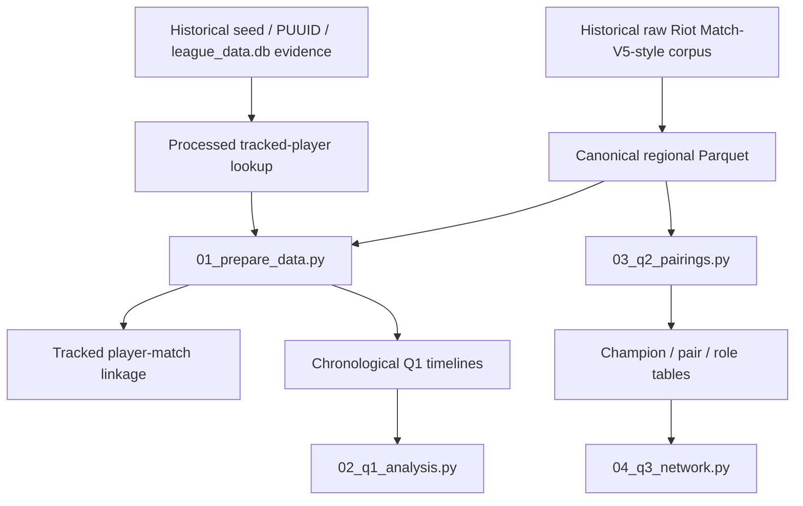

# Data & Pipeline Guide

This document describes the **data layers, provenance, analytical units, transformations, and generated outputs** used by the final project. The submitted workflow intentionally begins at the processed-data stage rather than reprocessing the original raw Riot JSON corpus.

---

## 1. Data lineage



The historical raw-extraction and identity-reconstruction steps are preserved as provenance/history, but they are not part of the compact submitted execution path.

---

## 2. Canonical processed corpus

Regional roots:

```text
data/processed/full_na/
data/processed/full_kr/
data/processed/full_eu/
```

Each region contains:

| Table | Unit | Main use in final pipeline |
| --- | --- | --- |
| `matches/` | one row per physical match | Q1 end-result/context joins and validation |
| `participants/` | one row per player-match | Q1 tracked linkage; Q2 team/champion analysis |
| `teams/` | two rows per physical match | structural validation; available for future team/objective work |
| `team_bans/` | champion-ban records | validated/preserved; not required by the three current analyses |
| `audit/` | extraction metadata | provenance/schema diagnostics |

### Corpus scale

| Region | Matches | Participant rows | Team rows |
| --- | ---: | ---: | ---: |
| NA | 69,393 | 693,930 | 138,786 |
| KR | 61,381 | 613,810 | 122,762 |
| EU | 366,328 | 3,663,280 | 732,656 |
| **Total** | **497,102** | **4,971,020** | **994,204** |

The canonical tables were previously checked for basic structural integrity, including unique match IDs, ten unique participants per match, two teams per match, valid player hashes, and non-negative chronological ordering in the derived longitudinal data.

---

## 3. Player identity and tracking provenance

Problem 1 requires repeated observations of the **same player** across matches. The corpus therefore includes two processed tracked-player lookup cohorts:

```text
data/processed/tracking/authoritative/<REGION>/tracked_players.parquet
data/processed/tracking/alias_confirmed/<REGION>/tracked_players.parquet
```

### Authoritative cohort

The main longitudinal cohort combines:
- uniquely resolved fresh seed aliases; and
- stable PUUID evidence from the historical database, included only when assignment to a regional processed corpus was unambiguous.

Final authoritative player-region identities:

| Region | Identities |
| --- | ---: |
| NA | 1,581 |
| KR | 1,291 |
| EU | 8,297 |
| **Total** | **11,169** |

Authoritative physical-match coverage is approximately **100% in NA, 100% in KR, and 99.95% in EU**.

### Alias-confirmed cohort

`alias_confirmed` is the stricter subset where a fresh seed alias resolved uniquely to the underlying raw PUUID. It is used as a **robustness cohort**, not as the primary population.

### Important provenance rule

Do **not** infer tracked players from match count, history length, display name frequency, or the fact that a player appears in many matches. Membership comes only from the retained processed lookup tables.

The lookups are inputs to the final reproduction because the anonymized canonical Parquet stores `player_id = SHA256(PUUID)[:32]`; the original raw identity evidence cannot be reconstructed from those hashes alone.

---

## 4. `01_prepare_data.py`: processed-data preparation

`01_prepare_data.py` is the shared preparation stage for Problem 1. It does four things:

1. validates the canonical regional tables and tracked-player lookup tables;
2. rebuilds tracked player-match linkage for `authoritative` and `alias_confirmed`;
3. writes compact coverage/readiness audits;
4. constructs chronological target-centric Q1 timelines.

### Generated linkage

```text
data/processed/tracking/linked/authoritative/<REGION>/part-*.parquet
data/processed/tracking/linked/alias_confirmed/<REGION>/part-*.parquet
```

Unit:

```text
one tracked player × one observed physical match
```

Unique key:

```text
(source, player_id, match_id)
```

The linkage is deliberately sharded to avoid very large single files.

### Generated audits

```text
data/processed/tracking/coverage_audit/
data/processed/analysis_audit/
```

These contain coverage summaries, linkage counts, processed-input quality checks, analytical-readiness checks, and next-match feasibility diagnostics.

---

## 5. Q1 chronological timelines and leakage control

Generated timelines:

```text
data/analysis/timelines/ranked_history/<REGION>.parquet
data/analysis/timelines/solo420_targets/<REGION>.parquet
```

The Q1 target table is deliberately **target-centric**:

- `target_*` — information/outcomes from the target match;
- `prev_*` — immediately previous observed ranked match;
- `prior_*` — expanding history strictly before the target;
- `ranked_games_prev_*h` and `ranked_minutes_played_prev_*h` — recent activity strictly before target start;
- session IDs/depths — derived from historical inter-match gaps;
- champion/role change indicators — computed relative to the previous ranked match.

The central leakage rule is:

> **No variable produced during the target match is used as a predictor of that same target match.**

### Q1 analysis design

| Choice | Primary | Sensitivity / alternative |
| --- | --- | --- |
| Target queue | 420 Ranked Solo/Duo | — |
| Ranked history | 420 + 440 | — |
| Target duration | >=10 min | >=5 min robustness |
| Session boundary | 30 min | 45 / 60 / 90 min |
| Recent activity window | 6 h | 3 / 12 / 24 h |
| Main cohort | authoritative | alias-confirmed robustness |
| Primary outcome | target victory | — |

### Q1 inferential model

The primary statistical analysis is a **within-player linear probability model**:

- player fixed effects via within-player demeaning;
- dynamic pre-target controls and patch controls;
- two-way cluster-robust uncertainty by `player_id` and physical `match_id`;
- effects reported as percentage-point changes in next-match win probability;
- Holm correction applied within the predefined hypothesis/specification families.

### Q1 predictive model

Prediction uses entropy-based `DecisionTreeClassifier` models with:

- chronological 70% / 15% / 15% train/validation/test splitting within region;
- training-defined region/patch categories;
- training-median imputation;
- pre-pruning grid over `max_depth` and `min_samples_leaf`;
- validation ROC-AUC for model selection;
- majority and historical-win-rate baselines;
- accuracy, precision, recall, F1, confusion matrices, ROC and ROC-AUC on the held-out test set.

Three feature sets are compared:
- historical/context features;
- behavioral timing/activity features;
- combined history + behavior.

---

## 6. Problem 2 data model: champion pairs

Problem 2 does **not** use the tracked-player cohort. Its unit is the **team composition**, so it uses all valid teams in the canonical participant tables.

`03_q2_pairings.py` keeps:
- queue 420 matches;
- duration >=10 minutes;
- teams with exactly five participant rows;
- five distinct champion IDs;
- a consistent team win value.

Each valid five-champion team contributes:

```text
C(5, 2) = 10 unordered champion pairs
```

### Champion statistics

For each champion:
- appearances;
- pick rate among valid teams;
- observed win rate;
- role/position appearance counts.

### Pair statistics

For each unordered pair `(A, B)`:

**Raw support**

```text
games_together
```

**Expected co-picks from individual popularity**

```text
expected_AB = appearances_A * appearances_B / number_of_valid_teams
```

**Lift**

```text
lift = observed_games_together / expected_AB
```

**Normalized association**

```text
association = log2(lift)
```

Interpretation:
- `association > 0`: together more often than expected;
- `association = 0`: approximately as often as expected;
- `association < 0`: together less often than expected.

**Descriptive win surplus**

```text
baseline = (win_rate_A + win_rate_B) / 2
win_surplus_pp = 100 * (pair_win_rate - baseline)
```

This is intentionally called **win surplus**, not causal synergy. It is a descriptive comparison and can reflect champion strength, roles, player skill, patch effects, selection effects, and other confounding.

### Problem 2 support thresholds

- `MIN_PAIR_GAMES = 500` for the combo landscape / supported relationship analysis;
- `MIN_PERFORMANCE_GAMES = 1000` for ranked normalized-performance displays.

Outputs become the compact input tables for Problem 3.

---

## 7. Problem 3 data model: champion network

`04_q3_network.py` reads:

```text
data/analysis/q2/tables/champion_stats.csv
data/analysis/q2/tables/pair_stats.csv
data/analysis/q2/tables/role_counts.csv
```

This avoids rereading millions of participant rows for every graph method.

### Graph definitions

**Raw frequency graph**
- node = champion;
- edge = observed same-team co-pick;
- weight = `games_together`.

This graph is mainly used as a popularity-oriented comparison.

**Normalized association graph**
- node = champion;
- include an edge only when `games_together >= 500` and `association > 0`;
- edge weight = positive `log2(lift)`.

This supported positive-association graph is the main structural graph for Problem 3.

### Louvain communities

Louvain community detection runs on the **largest connected component** of the association graph using association weight. Modularity describes how strongly the resulting partition concentrates weight within communities relative to between communities.

Champions outside that largest component remain in the output table with community `0` rather than being presented as misleading singleton communities.

### PageRank

Two PageRank variants are saved:
- raw-frequency PageRank;
- normalized-association PageRank.

The report emphasizes **association-weighted PageRank**, because raw-frequency PageRank is more directly influenced by overall champion popularity.

### Cliques and overlapping communities

To avoid treating every triangle in a dense graph as meaningful, clique analysis first keeps only association edges in the **top 20% of edge weight** within the largest association component.

The script then computes:
- maximal cliques of size >=3;
- mean association within each clique;
- minimum pair support in each clique;
- mean descriptive win surplus;
- 3-clique-percolation communities for overlapping higher-order structure.

### Girvan-Newman comparison

Girvan-Newman is run on a compact high-centrality subgraph to keep the method computationally practical. The best of the first several partitions is selected by modularity. It is a **comparison method**, not the primary community result.

### Conventional clustering comparison

Co-pick profile vectors are built for champions with at least three supported positive-association links.

Methods:
- **K-Means++**, candidate `k = 2..6`;
- **Agglomerative hierarchical clustering** with Ward linkage;
- **DBSCAN** with `min_samples = 4` and epsilon estimated from the 85th percentile of nearest-neighbour distances;
- **PCA** for 2D display only;
- **cosine similarity** for similarity of overall co-pick profiles.

K-Means is evaluated with both:
- within-cluster SSE / inertia;
- silhouette score.

These clustering methods are treated as alternative views of the champion profiles, not as ground-truth communities.

### Display-only graph filtering

The report network visualization is deliberately limited to high-centrality nodes and strong edges for readability. This display filtering does **not** redefine the underlying graph used for Louvain/PageRank calculations.

---

## 8. Output contracts

### Q1

```text
data/analysis/q1/
├── audit/q1_summary.json
├── figures/report/
├── figures/supplementary/
├── predictions/test_predictions.parquet
└── tables/
```

Important tables include:
- `behavior_effects.csv`;
- `statistical_model_summary.csv`;
- `test_metrics.csv`;
- `validation_grid.csv`;
- `feature_importance.csv`;
- `robustness_behavior_effects.csv`;
- `robustness_comparison_to_primary.csv`;
- `key_results_for_report.csv`.

### Q2

```text
data/analysis/q2/
├── summary.json
├── tables/
│   ├── champion_stats.csv
│   ├── role_counts.csv
│   └── pair_stats.csv
└── figures/
    ├── report/
    └── supplementary/
```

### Q3

```text
data/analysis/q3/
├── summary.json
├── tables/
│   ├── centrality.csv
│   ├── louvain_communities.csv
│   ├── girvan_newman_communities.csv
│   ├── maximal_cliques.csv
│   ├── clique_percolation_communities.csv
│   ├── cluster_assignments.csv
│   ├── kmeans_model_selection.csv
│   ├── profile_similarity.csv
│   └── community_role_percent.csv
└── figures/
    ├── report/
    └── supplementary/
```

---

## 9. Input vs generated data

### Preserve as inputs

```text
data/processed/full_na/
data/processed/full_kr/
data/processed/full_eu/
data/processed/tracking/authoritative/
data/processed/tracking/alias_confirmed/
data/processed/tracking/audit/
data/data_sources.txt
```

### Safe to regenerate

```text
data/analysis/
data/processed/analysis_audit/
data/processed/tracking/linked/
data/processed/tracking/coverage_audit/
```

Use:

```bash
python code/run_project.py clean --yes
```

The command intentionally does **not** remove canonical `full_*` inputs or tracked-player lookup tables.

---

## 10. Interpretation boundaries

1. The corpus was produced through a crawler/seed process and is therefore not a simple random sample of all League of Legends players.
2. Q1 observes behavioral timing, not psychological state. Terms such as fatigue or tilt should not be treated as directly measured variables.
3. Q2 lift measures **co-selection relative to popularity**, not causal champion synergy.
4. Q2 win surplus is descriptive and confounded by player/champion/role/meta factors.
5. Q3 communities summarize network structure and role complementarity; they do not prove strategic intent.
6. Thresholds such as 30-minute sessions, 500 shared games, and strong-edge quantiles are modeling/visualization choices and should be interpreted together with sensitivity/comparison analyses.
7. Huge sample sizes make effect magnitude, confidence intervals, predictive value, and robustness more informative than isolated statistical significance.
