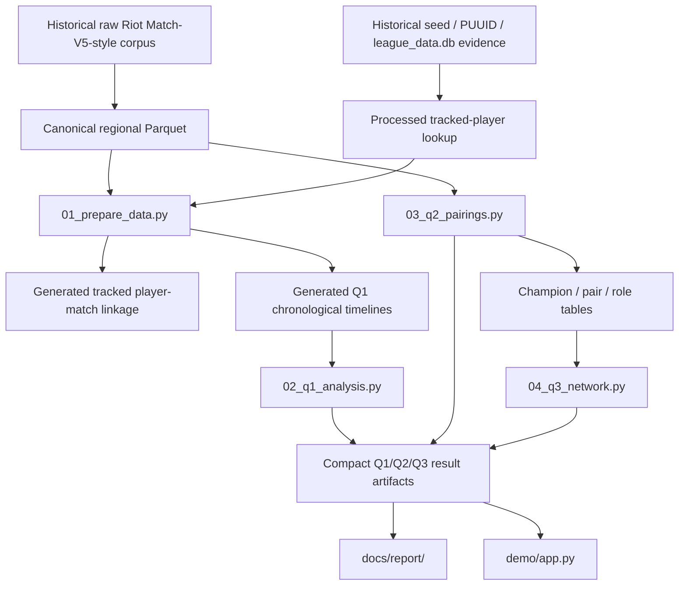

# Data & Pipeline Guide

This document is the technical reference for the project's **data layers, provenance, analytical units, transformations, and generated outputs**.

The submitted workflow intentionally starts at the processed-data stage rather than reprocessing the original Riot Match-V5-style JSON corpus.

---

## 1. Data lineage



The historical raw-extraction and identity-reconstruction steps are part of project provenance, but they are not part of the compact default execution path.

---

# 2. Data layers

## 2.1 Canonical processed regional data

```text
data/processed/full_na/
data/processed/full_kr/
data/processed/full_eu/
```

Each region contains:

```text
matches/
participants/
teams/
team_bans/
audit/
```

### `matches/`

One row per physical match. Used for match-level identifiers, queue, timestamps, duration, and end-state validation.

### `participants/`

One row per player-match. This is the primary source for:

- tracked-player linkage;
- Q1 historical performance features;
- champion identity and role;
- Q2 team-composition analysis.

### `teams/`

Two rows per match. Retained as part of the canonical relational dataset and available for team-level extensions/checks.

### `team_bans/`

Champion-ban records. Retained as canonical processed data even though the current final three problems do not use bans as a primary signal.

### `audit/`

Extraction-time metadata such as:

```text
errors.jsonl
run_summary.json
schema_observed.json
```

These small files are useful provenance and are not regenerated by the submitted processed-stage pipeline.

---

## 2.2 Canonical corpus scale

| Region | Matches | Participant rows | Team rows |
| --- | ---: | ---: | ---: |
| NA | 69,393 | 693,930 | 138,786 |
| KR | 61,381 | 613,810 | 122,762 |
| EU | 366,328 | 3,663,280 | 732,656 |
| **Total** | **497,102** | **4,971,020** | **994,204** |

The corpus spans approximately October 2025 through January 2026.

---

## 2.3 Processed tracked-player lookup

```text
data/processed/tracking/authoritative/<REGION>/tracked_players.parquet
data/processed/tracking/alias_confirmed/<REGION>/tracked_players.parquet
```

These are **inputs**, not generated intermediates.

### `authoritative`

Main longitudinal cohort used by Problem 1.

An authoritative identity is supported by one of the project's unambiguous identity-resolution routes, including stable Riot PUUID evidence and regional corpus assignment.

### `alias_confirmed`

Stricter direct alias-confirmed subset used for robustness.

### Tracking audit

```text
data/processed/tracking/audit/
```

Contains compact provenance such as seed-alias resolution details and cohort summaries. Keep it with the processed inputs.

### Important rule

Do **not** infer tracked status from history length, number of matches, or champion activity.

The longitudinal identity key is the processed `player_id`, and the conceptual unique player-match key is:

```text
(source, player_id, match_id)
```

---

# 3. Generated preparation outputs

`01_prepare_data.py` validates the processed inputs and rebuilds the following products.

## 3.1 Tracked player-match linkage

```text
data/processed/tracking/linked/
├── authoritative/
└── alias_confirmed/
```

Each row is one tracked player in one observed match.

These Parquet shards are reproducible from:

- canonical `participants/`;
- the retained tracked-player lookup tables.

They are therefore safe to delete and regenerate.

---

## 3.2 Tracking coverage audit

```text
data/processed/tracking/coverage_audit/
```

Generated tables include:

```text
linked_player_match_summary.csv
match_tracking_coverage_summary.csv
processed_input_quality_checks.csv
uncovered_matches_summary.csv
```

These summarize physical-match coverage and input consistency.

---

## 3.3 Analytical-readiness audit

```text
data/processed/analysis_audit/
```

Generated outputs include:

```text
data_quality_checks.csv
dataset_overview.csv
next_match_analysis_feasibility.csv
pipeline_summary.json
```

These verify that the linked longitudinal data are suitable for chronological next-match analysis.

---

# 4. Problem 1 timeline layer

`01_prepare_data.py` builds:

```text
data/analysis/timelines/
├── audit/
├── ranked_history/
│   ├── NA.parquet
│   ├── KR.parquet
│   └── EU.parquet
└── solo420_targets/
    ├── NA.parquet
    ├── KR.parquet
    └── EU.parquet
```

These are generated and normally ignored by Git because they are large/reproducible.

## Leakage-control convention

The target tables are explicitly target-centric:

```text
target_*   = information from the target match
prev_*     = immediately previous observed history
prior_*    = history strictly before the target
```

Recent-volume, gap, streak, and session features are also computed strictly before each target match.

This separation is the main leakage-control mechanism in Problem 1.

---

# 5. Problem 1 design

## Target and history scope

- target queue: **420 — Ranked Solo/Duo**;
- observed ranked history: **420 + 440**;
- primary target-duration rule: **>=10 minutes**;
- short-game robustness: **>=5 minutes**.

## Session definition

Primary session boundary:

```text
30 minutes
```

Sensitivity:

```text
45 / 60 / 90 minutes
```

A new observed session begins when the gap from the previous ranked match exceeds the selected threshold.

## Recent ranked volume

Primary window:

```text
6 hours
```

Sensitivity:

```text
3 / 12 / 24 hours
```

Both recent game count and recent minutes played are derived from strictly pre-target history.

## Post-loss requeue timing

The post-loss analysis is restricted to targets whose previous ranked match:

- exists;
- was a loss;
- lasted at least 10 minutes in the primary specification.

The primary categorical bins range from `<=5m` through `>24h`, with a continuous `log2(1 + gap)` sensitivity specification.

---

# 6. Problem 1 statistical model

The primary inferential model is a **linear probability model of target victory**.

Key design choices:

- player fixed effects implemented by within-player demeaning;
- pre-target historical/context controls;
- patch controls;
- two-way clustered uncertainty by `player_id` and physical `match_id`;
- Holm family-wise correction within predefined behavior-effect families.

The preferred interpretation is:

> percentage-point change in next-match win probability within the same player, conditional on the included controls.

The model is observational. It is not a causal estimate of fatigue or psychological tilt.

---

# 7. Problem 1 prediction

The course-aligned predictive model is an entropy decision tree:

```text
criterion = "entropy"
```

Three feature sets are evaluated:

1. history/context only;
2. behavior only;
3. combined history + behavior.

Chronological split within each region:

```text
70% train / 15% validation / 15% test
```

Validation chooses:

```text
max_depth
min_samples_leaf
```

Final test evaluation includes:

- majority baseline;
- rolling historical-win-rate baseline;
- accuracy;
- precision;
- recall;
- F1;
- confusion matrix;
- ROC;
- ROC-AUC.

The app/report use the held-out test results, not training performance.

---

# 8. Problem 1 outputs

```text
data/analysis/q1/
├── audit/
├── figures/
│   ├── report/
│   └── supplementary/
├── predictions/
└── tables/
```

### Compact artifacts useful for GitHub/demo

```text
audit/q1_summary.json
tables/*.csv
figures/report/*.png
figures/supplementary/*.png
```

### Large generated artifact normally ignored

```text
predictions/test_predictions.parquet
```

---

# 9. Problem 2 — Champion Pairings & Combo Performance

## Research question

> Which champion pairs are selected together more often than expected, and how is co-selection strength related to pair performance?

## Inputs

Canonical participant Parquet:

```text
data/processed/full_{na,kr,eu}/participants/*.parquet
```

Filtering:

- queue 420;
- target duration >=10 minutes;
- non-null champion/team/win fields;
- exactly five rows per team;
- five distinct champion IDs;
- one consistent team result.

## Analytical unit

One **unordered champion pair** within one valid five-champion team.

Each valid team contributes:

```text
C(5,2) = 10 unordered pairs
```

before aggregation.

## Measures

### Raw co-pick support

```text
games_together
```

Answers:

> Which pairs are simply observed together most often?

### Expected co-picks under independent popularity

Let:

```text
A = appearances of champion A
B = appearances of champion B
T = number of valid teams
```

Then:

```text
expected = A × B / T
```

### Lift

```text
lift = observed games together / expected games together
```

### Normalized association

```text
association = log2(lift)
```

Interpretation:

- `0` = approximately expected from individual popularity;
- `>0` = selected together more often than expected;
- `<0` = selected together less often than expected.

### Pair win surplus

```text
100 × [pair win rate − mean(individual champion win rates)]
```

This is a descriptive comparison baseline, not a causal synergy estimate.

## Support thresholds

- **500** games together for the combo landscape;
- **1000** games together for high-support ranked performance displays.

## Outputs

```text
data/analysis/q2/
├── figures/
│   ├── report/
│   └── supplementary/
├── tables/
│   ├── champion_stats.csv
│   ├── pair_stats.csv
│   └── role_counts.csv
└── summary.json
```

These compact outputs are directly used by Problem 3 and the Streamlit demo.

---

# 10. Problem 3 — Champion Network Structure & Team-Composition Communities

## Inputs

Problem 3 intentionally consumes the compact Problem 2 tables:

```text
data/analysis/q2/tables/champion_stats.csv
data/analysis/q2/tables/pair_stats.csv
data/analysis/q2/tables/role_counts.csv
```

This avoids rescanning the full participant corpus.

## Graphs

### Raw-frequency graph

- node = champion;
- edge weight = `games_together`.

Used as a popularity-oriented comparison.

### Primary normalized-association graph

- node = champion;
- edge retained when `games_together >= 500`;
- edge retained when `association > 0`;
- edge weight = positive `log2(lift)`.

This graph is the main structural object used in the report.

## Louvain communities

Louvain is run on the largest supported association component.

The output is interpreted together with observed role composition:

```text
Top / Jungle / Mid / ADC / Support
```

to assess whether purely network-derived communities have recognizable composition structure.

## Association-weighted PageRank

PageRank ranks champions by their structural position in the above-expected co-selection network.

This is preferred over raw-frequency PageRank for the main report because it reduces the direct influence of simple champion popularity.

## Maximal cliques

Clique analysis first retains the strongest 20% of association edges, then searches for fully connected groups of size >=3.

These are higher-order co-selection motifs, not causal strategic recommendations.

## Clique percolation

3-clique percolation provides an overlapping-community view.

## Comparison methods

The project also evaluates:

- Girvan-Newman;
- K-Means++ on standardized co-pick profiles;
- elbow/SSE;
- silhouette validation for `k=2..6`;
- Ward hierarchical clustering;
- DBSCAN;
- PCA;
- cosine profile similarity.

These are supplementary/comparison methods rather than the primary network partition.

## Outputs

```text
data/analysis/q3/
├── figures/
│   ├── report/
│   └── supplementary/
├── tables/
│   ├── centrality.csv
│   ├── louvain_communities.csv
│   ├── maximal_cliques.csv
│   ├── community_role_percent.csv
│   ├── cluster_assignments.csv
│   └── ...
└── summary.json
```

---

# 11. Generated outputs and GitHub policy

The local project can contain more data than the GitHub repository.

## Keep locally as required scientific inputs

```text
data/processed/full_na/
data/processed/full_kr/
data/processed/full_eu/

data/processed/tracking/authoritative/
data/processed/tracking/alias_confirmed/
data/processed/tracking/audit/
```

## Safe to regenerate / normally ignored

```text
data/analysis/timelines/
data/analysis/q1/predictions/

data/processed/analysis_audit/
data/processed/tracking/linked/
data/processed/tracking/coverage_audit/
```

## Compact generated outputs intentionally useful to commit

```text
data/analysis/q1/{audit,tables,figures}/
data/analysis/q2/
data/analysis/q3/
```

Keeping those compact result artifacts in GitHub lets:

- staff inspect the final result tables/figures directly;
- the Streamlit demo run without access to the full Parquet corpus;
- Streamlit Community Cloud deploy from the repository alone.

---

# 12. Final report and demo

## Report

```text
docs/report/
├── Report.pdf
├── Report.docx
├── Report_noimages.pdf
├── Report_noimages.docx
└── graphics/
```

The report consumes the curated report figures under each problem's `figures/report/` directory.

## Streamlit demo

```text
demo/app.py
```

The app reads compact outputs from:

```text
data/analysis/q1/
data/analysis/q2/
data/analysis/q3/
```

It does **not** need:

- `data/analysis/timelines/`;
- Q1 prediction Parquet;
- tracking linkage shards;
- canonical `full_*` Parquet;
- the raw JSON corpus.

That is why the hosted demo can remain lightweight even though the full scientific reproduction is data-intensive.

---

# 13. Safe interpretation boundaries

### Problem 1

Report:

- within-player temporal associations;
- predictive performance.

Do not claim:

- measured psychological tilt;
- causal fatigue effects.

### Problem 2

Report:

- raw co-pick frequency;
- normalized co-selection;
- descriptive pair performance.

Do not claim:

- causal champion synergy;
- optimal team recommendations.

### Problem 3

Report:

- network structure;
- role-related communities;
- centrality;
- higher-order co-selection motifs.

Do not claim:

- strategic intent;
- causally optimal composition structure.

The common theme across all three problems is **descriptive/associational structure with explicit leakage and interpretation controls**.
